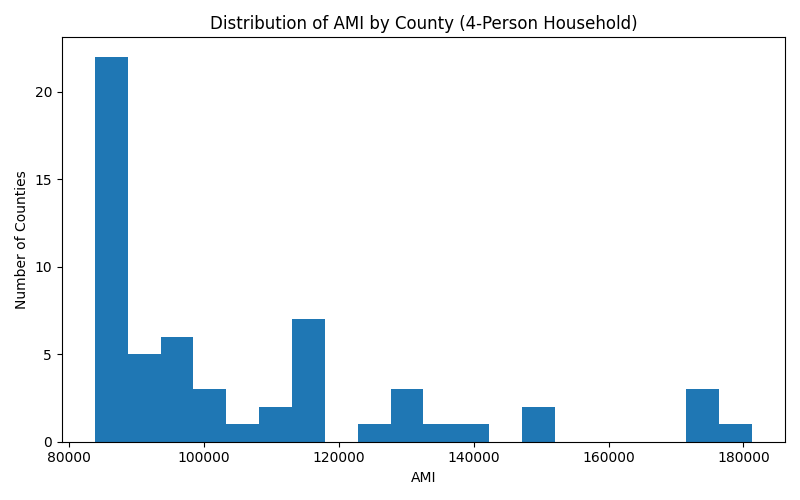
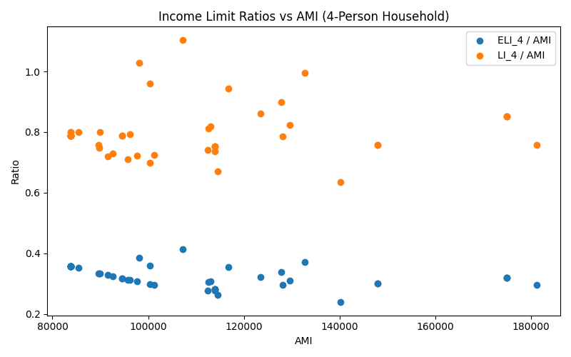

# OpenData Insight: California Income Limits (2023)

## Overview
California housing affordability programs often rely on income limits derived from **Area Median Income (AMI)**.  
This project analyzes **county-level income limits (2023)** for a **4-person household** to understand how affordability thresholds vary across California and how consistently different income categories scale with AMI.

The project is designed as a **reproducible, script-based data pipeline** (not a notebook) and produces:
- a cleaned dataset (selected columns),
- summary statistics (top/bottom counties by AMI),
- visualizations for distribution and ratio patterns.

---

## Data Source
- **California Income Limits by County (2023)** (CSV)

Dataset columns include AMI and income limits for different household sizes and categories:
- AMI (Area Median Income)
- ELI (Extremely Low Income)
- VLI (Very Low Income)
- LI (Low Income)
- MOD (Moderate Income)

This project focuses on the **4-person household** fields:
- `AMI`, `ELI_4`, `VLI_4`, `LI_4`, `MOD_4`

---

## Key Questions
1. How much does **AMI** vary across California counties?
2. Do **ELI** and **LI** thresholds scale proportionally with AMI across regions?
3. Are income limit ratios (e.g., `ELI_4 / AMI`) relatively stable, suggesting standardized policy thresholds?

---

## Key Findings (V1)
Based on the script output:
- **AMI varies substantially** across counties (e.g., highest counties exceed ~$180k, lowest around ~$83k).
- The **ELI-to-AMI ratio** is relatively stable across counties (average around **~0.33**).
- The **LI-to-AMI ratio** is also relatively stable (average around **~0.80**).
- This suggests that income limits may be driven more by **standardized policy ratios** than by highly localized market conditions.

(These findings are computed from the 4-person household fields in the dataset.)

---

## Visualizations 





---
## How to Run

```bash
# 1. Create virtual environment
python -m venv .venv
source .venv/bin/activate  # Windows: .venv\Scripts\activate

# 2. Install dependencies
pip install -r requirements.txt

# 3. Run pipeline
python src/main.py

## Project Structure
```text
opendata-insight/
├── data/
│   ├── raw/                  # raw CSV files (source data)
│   │   └── 2023-income-limits.csv
│   └── processed/            # cleaned/processed outputs
│       └── clean_v1.csv
├── reports/
│   └── figures/              # generated plots
│       ├── ami_distribution.png
│       └── eli_li_ratio_scatter.png
├── src/
│   └── main.py               # main pipeline script
├── requirements.txt
└── README.md
